# Network Tracker

Network tracking made easy — a private tracker for the people I want to stay connected with
at UC Berkeley. Each person signs in, keeps their own list of contacts — name, company, role,
where we met, notes, and a priority — and can search, filter, and sort it. **One user's
contacts are unreachable to every other user, and that guarantee is enforced by the database
itself rather than by the app being polite.** Postgres Row Level Security rejects rows that
are not yours, so even a request that skips the app entirely comes back empty.

> **Status: complete.** Deployed, tested, and documented. Build history is in
> [docs/ROADMAP.md](docs/ROADMAP.md).

---

## 1. Live URL

**→ https://qw-network-tracker.vercel.app** — open this one.

| | |
|---|---|
| App (frontend) | https://qw-network-tracker.vercel.app |
| API (backend) | https://qw-network-tracker-api.vercel.app |
| API health check | https://qw-network-tracker-api.vercel.app/health |

Two URLs because the frontend and backend are two separate applications with
separate builds and separate deployments. The API serves no pages; opening it directly
shows only JSON. **Sign in at the first URL.**

Test accounts are in §13 if you want to see the two-account isolation for yourself.

---

## 2. How It Works, In Plain Terms

The three things worth understanding, without the jargon.

### The schema — what a contact is

The database holds one table, `contacts`. Think of it as a spreadsheet the database owns.
Each row is one person you have met, with columns for their name, company, role, where you
met, notes, and a priority.

One column matters more than the rest: **`user_id`, the owner**. Every row is stamped with
who it belongs to — and the stamp is applied *by the database*, not by the browser. The app
never sends it. That is deliberate: if the browser could choose the owner, anyone could
create a contact in someone else's name.

The database also refuses nonsense. A name cannot be blank or just spaces, and a priority
must be exactly `high`, `medium`, or `low`. Nothing else gets in, no matter what code is
asking.

### The RLS rule — why your contacts are private

Row Level Security is a rule enforced *by the database itself* rather than by the app.

Ordinarily an app decides what to show you: it fetches everything and displays your share.
That works until the app has a bug. RLS flips it around — the database refuses to hand over
rows that are not yours, so a bug in the app cannot leak anything, because the data never
reaches it.

Turning it on makes the table **deny-by-default**: nobody can read anything until a rule
explicitly permits it. There are four rules, one each for reading, creating, editing, and
deleting, and they all say the same thing:

> **This row's owner must be you.**

The editing rule has a second half worth knowing about. It says you may only edit rows you
already own, **and** the row must still belong to you afterwards. Without that, you could
edit one of your contacts and hand it to someone else.

You can see this working: signed in as one account the app shows three contacts, and as
another it shows none — same app, same database.

### The request flow — what happens when you add a contact

1. **You fill in the form and click Add.** The browser checks the obvious things first, so
   you get an instant answer. This is a courtesy, not a defence: anyone can bypass it.
2. **The browser collects your token.** Signing in gave you a tamper-proof pass, a bit like a
   festival wristband — it says who you are and cannot be altered without breaking its seal.
   It expires every fourteen minutes and renews itself.
3. **The contact and the pass go to the backend.** If there is no pass, the request is
   refused immediately.
4. **The backend checks the data properly.** Blank name or an invalid priority gets a clear
   message back. It also **throws away any owner the browser tried to specify.**
5. **The backend passes your token to the database.** It never uses a password of its own —
   it hands over yours, so the database still decides what you are allowed to touch.
6. **The database has the final say.** It stamps the row with your ID, checks the rules
   again, and applies Row Level Security.
7. **The saved contact comes back** and appears in your list.

Three layers check the same things, and that is the point. The browser is for speed, the
backend for clear errors, and the database is the one that cannot be talked around.

---

## 3. Screenshots

Captured from the **live deployment**, not a local build, by
[`scripts/screenshots.mjs`](scripts/screenshots.mjs). Run `node scripts/screenshots.mjs` to
regenerate them; credentials are read from the gitignored env file, so no password appears in
the script.

### Signing in and out

| Sign-in screen | Signed out again |
|---|---|
|  | 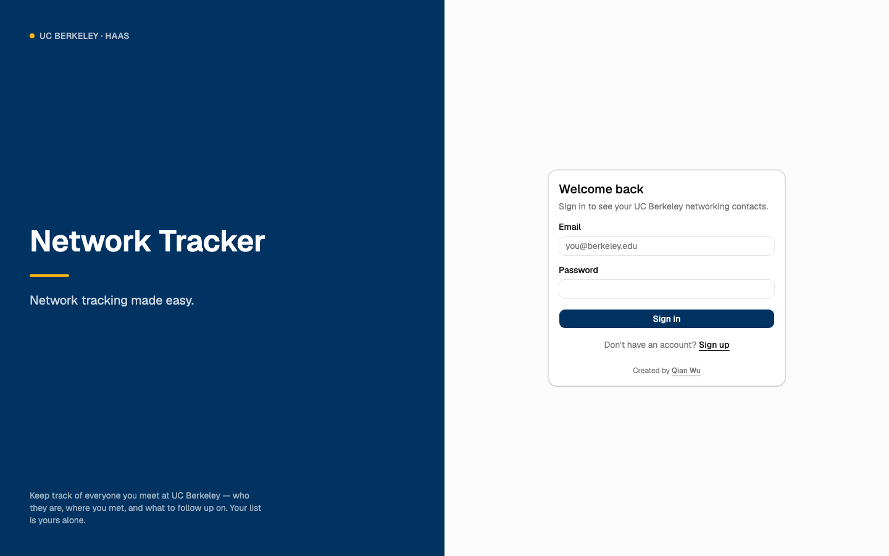 |

### Adding a contact

| Form filled in | Saved, with a confirmation |
|---|---|
| 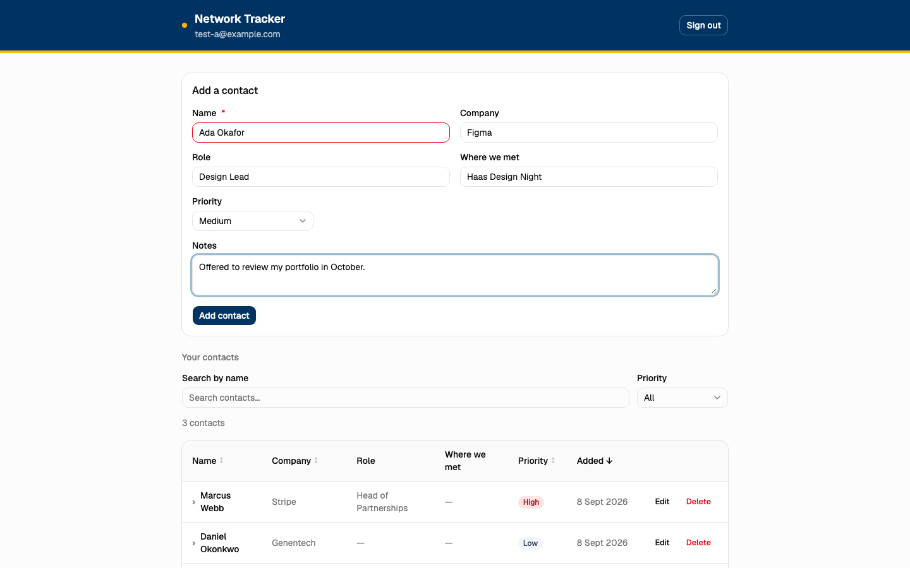 |  |

### It survives a refresh

Reloading the page re-fetches from Postgres. Nothing is held in the browser.

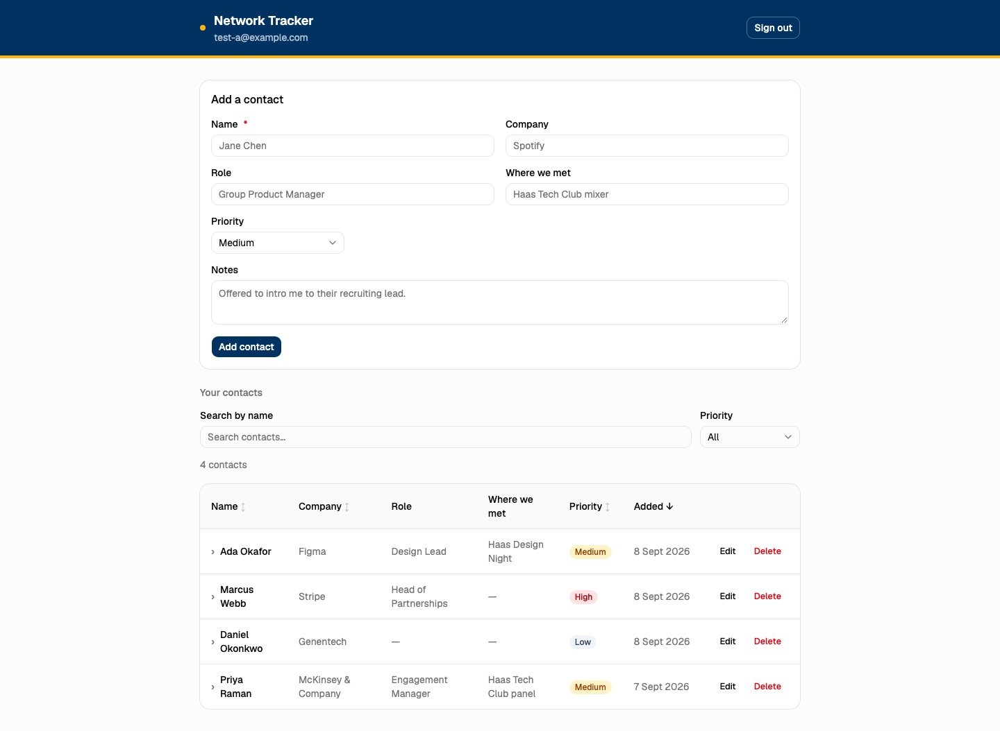

### Notes, on an expanded row

Every other field has a column; notes can be any length, so the row opens to show it.

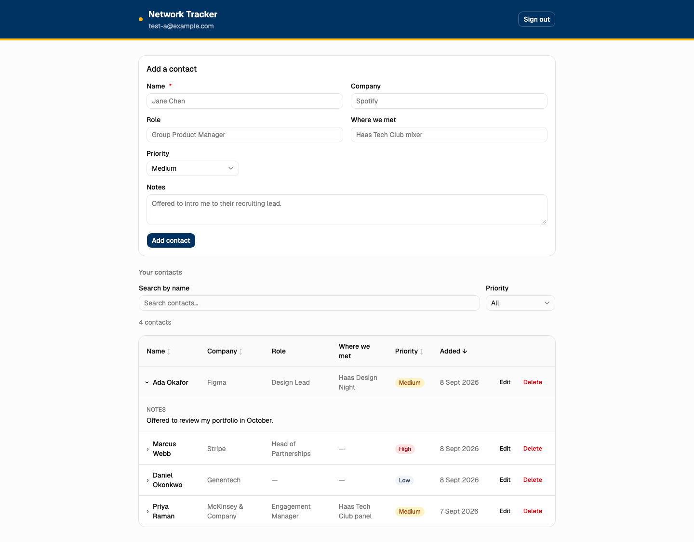

### Editing and deleting

| Editing | Deleting asks first |
|---|---|
| 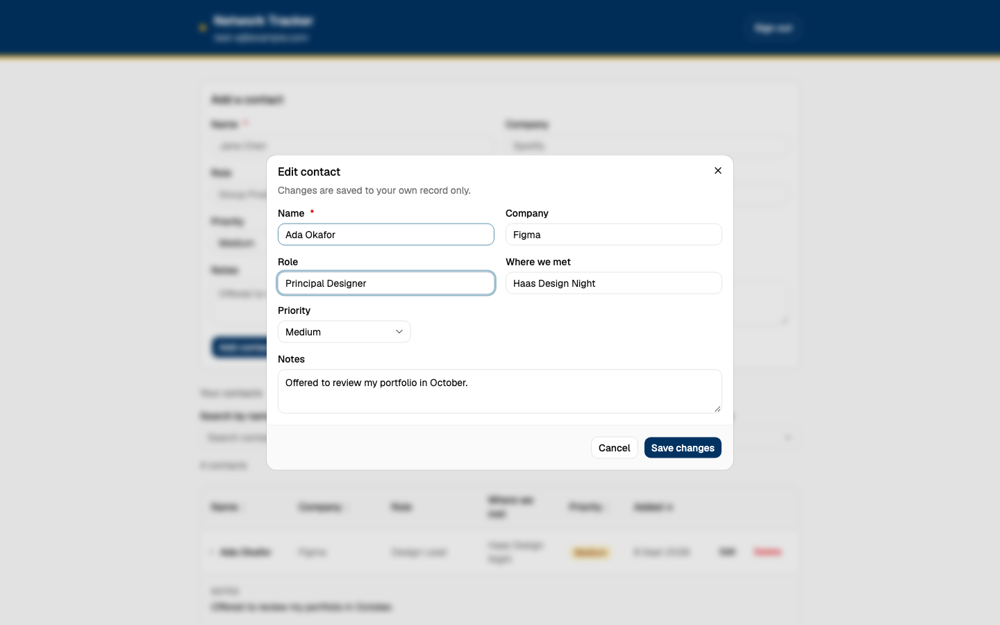 | 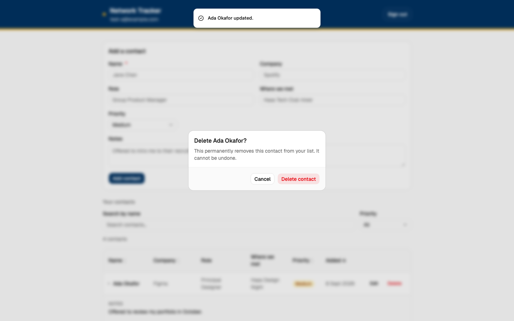 |

| Edit saved | Deleted |
|---|---|
| 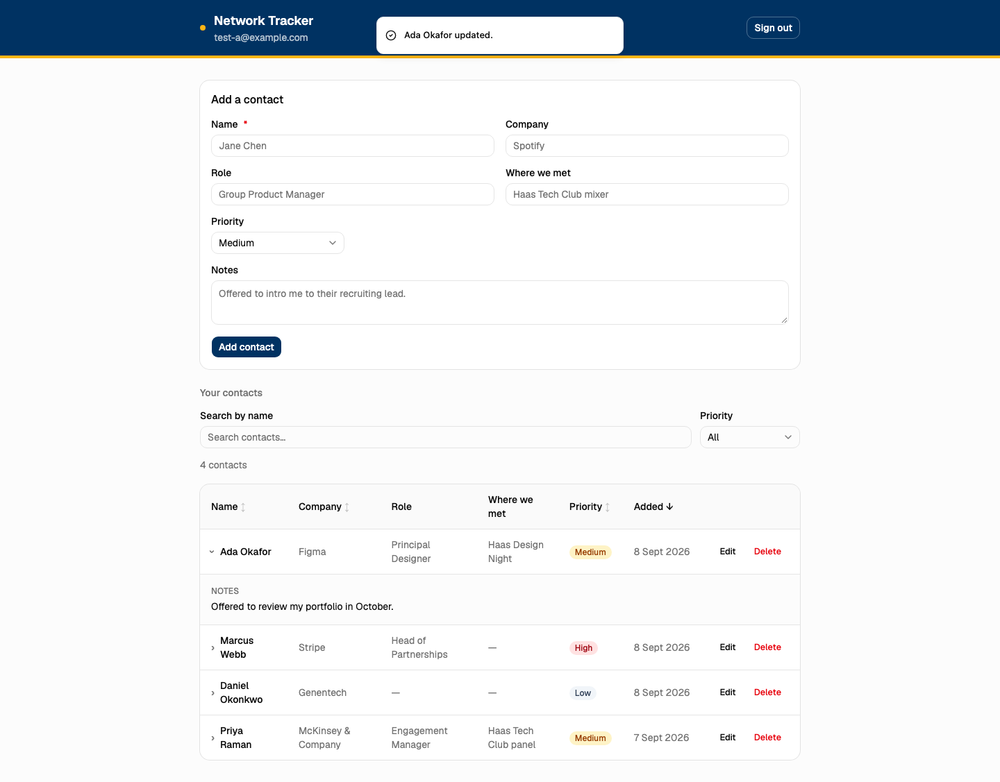 | 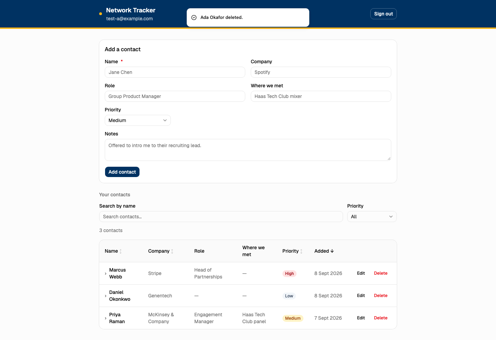 |

### Invalid input fails safely

Submitting a blank name. The message appears beside the field, the field is outlined, and no
request is sent. The API rejects the same thing independently — see §13.

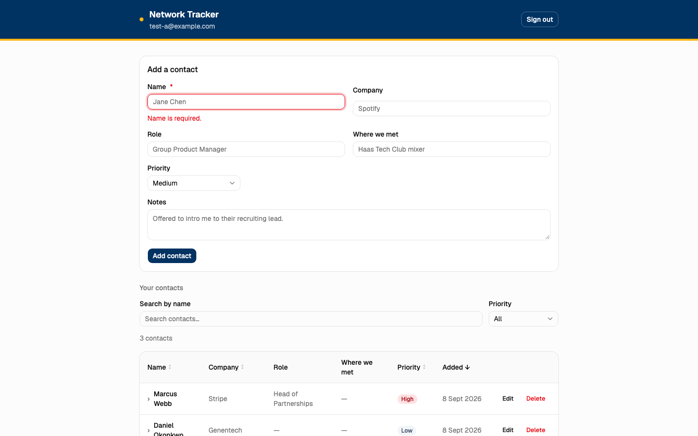

### The two-account privacy test

**The important pair.** Same app, same database, same moment — different accounts.

| User A — 3 contacts | User B — none |
|---|---|
|  | 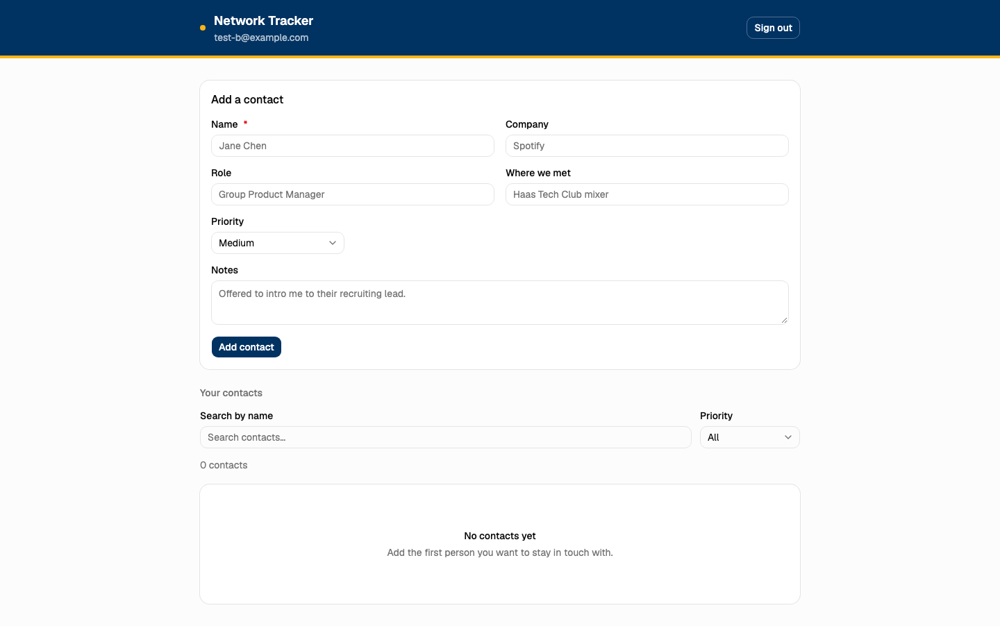 |

User B is not being *shown* an empty list. The rows were never sent, because Postgres refused
to return them. §12 proves this in a way a screenshot cannot: the isolation test queries the
database directly with User B's token, bypassing the app entirely, and still gets nothing.

### On a phone

| Sign-in | Contacts |
|---|---|
| 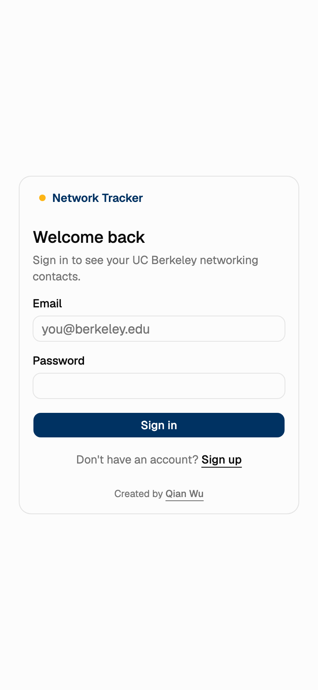 | 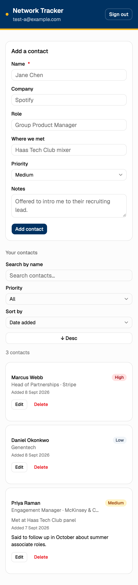 |

The brand panel is hidden below `lg` — on a phone it would push the form off-screen — and the
table becomes stacked cards.

---

## 4. Features

| Feature | Status |
|---|---|
| Sign up, sign in, sign out | ✅ |
| Add a contact (name, company, role, where we met, notes, priority) | ✅ |
| Priority restricted to `high` / `medium` / `low` | ✅ |
| View contacts in a table (desktop) or cards (mobile) | ✅ |
| Search by name | ✅ |
| Filter by priority | ✅ |
| Sort by clicking a column header — name, company, priority, or date added | ✅ |
| Date added shown in both layouts (web and mobile) | ✅ |
| Contacts survive a browser refresh | ✅ |
| Blank names and invalid priorities fail with a clear message | ✅ |
| Four list states, each with its own message: **loading** while contacts are fetched, **empty** when you have none yet, **no matches** when a filter excludes everything, **error** with a retry button when the request fails | ✅ |
| Success confirmation after add, edit, and delete | ✅ |
| Works on phone and desktop | ✅ |
| Edit a contact | ✅ |
| Delete a contact, with a confirmation step | ✅ |

---

## 5. Technology Stack

| Layer | Choice | Why |
|---|---|---|
| Frontend | Vite + React 19 + TypeScript | The assignment asks for a separated frontend and backend, and I wanted them genuinely separate — two builds, two deployments. Vite produces a pure frontend with no server in it, which makes that separation real rather than nominal. |
| Styling | Tailwind CSS v4 + shadcn/ui | shadcn copies component source into the repo instead of hiding it in a dependency, so I can open any component and explain it. Accessible and responsive by default. |
| Backend | Express 5 + TypeScript | Small, unopinionated, and readable. The whole API is four routes; a heavier framework would add concepts without adding safety. |
| Validation | Zod | Rules read like sentences and double as the unit-test surface. |
| Database | Neon Postgres | Required by the assignment. Row Level Security is the reason the privacy guarantee is credible. |
| Auth | Neon Managed Better Auth | Required by the assignment. |
| Data access | Neon Data API (PostgREST) | Required. Lets the API forward the user's own token so the database still decides what they may see. |
| Testing | Vitest | Fast, no configuration, and the validation suite runs with no database or network. |
| Hosting | Vercel | Required. Two projects, one per app. |

---

## 6. Architecture

Five pieces, each with one job:

| Piece | What it is | What it does |
|---|---|---|
| **Frontend** | `apps/web` — Vite + React, its own build | Everything you see and click. Holds no secrets and enforces no security; it asks the backend for data and renders it. |
| **Backend** | `apps/api` — Express + Zod, its own build | Checks you are signed in, validates what you send, strips any ownership the browser tries to claim, then forwards your token onward. Holds no database password. |
| **Database** | Neon Postgres | Stores the contacts, and is where security is actually enforced: RLS decides which rows you may touch, CHECK constraints decide what counts as valid data. |
| **Authentication** | Neon Managed Better Auth | Verifies email and password, and issues the signed token that proves who you are. We never see or store a password. |
| **Hosting** | Vercel — two projects | `qw-network-tracker` serves the frontend; `qw-network-tracker-api` runs the backend as a serverless function. Two separate builds and deployments, since the two apps are genuinely separate. Neon hosts the database and the auth service. |

```
Browser  ── sign in ─────────────────────────▶  Neon Managed Better Auth
(apps/web)                                          returns a signed JWT
   │
   │  fetch /contacts  +  Authorization: Bearer <jwt>
   ▼
apps/api  (Express + Zod)
   │  1. reject the request if there is no token
   │  2. validate the body
   │  3. strip any user_id the caller sent
   │  4. forward the caller's own token onward
   ▼
Neon Data API  ──▶  Postgres
                     ├─ RLS: four policies, auth.user_id() = user_id
                     └─ CHECK constraints on name and priority
```

Sorting and filtering run in Postgres, not in the browser. A row excluded by a filter is
one the browser never received — the same principle that keeps other people's rows away.

**What happens when I add a contact**

1. The browser checks the form and shows inline errors. This is a courtesy — it can be bypassed.
2. It asks Neon Auth for a fresh JWT and sends the contact to `POST /contacts`.
3. The API rejects the request outright if there is no token.
4. Zod validates the body. A blank name or a priority outside the three allowed values returns 400.
5. Any `user_id` in the request is **dropped**.
6. The API forwards the user's own token to the Data API.
7. Postgres fills `user_id` from `auth.user_id()`, checks the constraints, and applies the RLS insert policy.
8. The saved row comes back and the list refreshes.

**Three layers, doing different jobs**

| Layer | Job | Bypassable? |
|---|---|---|
| Browser | Fast, friendly feedback | Yes, trivially |
| API + Zod | Structured errors; strips forged ownership | Yes — the Data API URL is public |
| Postgres CHECK + RLS | The floor | **No** |

The honest version: the frontend holds the public Data API URL, so someone determined could
skip the API. What stops them is the constraints and RLS, because nothing reaches the table
without going through Postgres. The API tier buys clear errors, a home for logic, and the
separation the assignment asks for. **It is not the security boundary.**

**The API holds no database credential.** It forwards the user's token. There is no
`DATABASE_URL` in its environment and no secret in it to leak.

---

## 7. Repository Layout

```
apps/
  web/   Frontend — Vite + React. Its own build, its own deployment.
  api/   Backend  — Express + Zod. Its own build, its own deployment.
db/
  schema.sql   Table, constraints, RLS policies, grants. The security model.
docs/
  ROADMAP.md   Working build plan.
```

---

## 8. Local Setup

Requires Node 22 or newer (`node --version`).

```bash
git clone https://github.com/qianw92/qw-secure-networking-tracker.git
cd qw-secure-networking-tracker
npm install
```

Create the two environment files from their templates and fill in the values from your Neon
project (§9):

```bash
cp apps/web/.env.example apps/web/.env.local
cp apps/api/.env.example apps/api/.env.local
```

Create the database objects by running the contents of [`db/schema.sql`](db/schema.sql) in the
Neon SQL Editor.

Then run the two apps in **two separate terminals** — they are separate programs:

```bash
npm run dev
```

```bash
npm run dev:api
```

`npm run dev` starts the frontend on http://localhost:5173 — the one you open in a browser.
`npm run dev:api` starts the backend on http://localhost:8787, which serves no pages; the
frontend calls it. The app cannot load contacts unless both are running.

---

## 9. Environment Variables

Real values live in `.env.local`, which is gitignored. `.env.example` is committed with
placeholders. **No file in this repository contains a real secret.**

**`apps/web` — public.** Vite bundles anything with this prefix into the JavaScript every
visitor downloads. Safe here only because RLS decides what a token can actually reach.

| Variable | Purpose |
|---|---|
| `NEXT_PUBLIC_NEON_AUTH_URL` | Neon Auth endpoint — sign-up, sign-in, sessions |
| `NEXT_PUBLIC_NEON_DATA_API_URL` | Neon Data API endpoint |
| `NEXT_PUBLIC_API_BASE_URL` | The backend (`http://localhost:8787` locally) |

**`apps/api` — server-only.** Never sent to a browser.

| Variable | Purpose |
|---|---|
| `NEON_DATA_API_URL` | Where the API forwards the caller's token |
| `ALLOWED_ORIGINS` | Comma-separated list of origins allowed to call the API |

**On `NEXT_PUBLIC_`:** this is a Next.js convention and this frontend is Vite, which normally
only exposes `VITE_`-prefixed variables. `apps/web/vite.config.ts` sets
`envPrefix: ['VITE_', 'NEXT_PUBLIC_']` so the names the assignment specifies work as written.

**There is no `DATABASE_URL` anywhere.** Nothing in the running system connects to Postgres
with a password. The schema was applied through the Neon console.

---

## 10. Database Schema

Full source, with comments: [`db/schema.sql`](db/schema.sql).

| Column | Type | Notes |
|---|---|---|
| `id` | `uuid` | Primary key, `default gen_random_uuid()` |
| `user_id` | `text` | **`not null`, `default auth.user_id()`** — the owner |
| `name` | `text` | `not null`, `check (length(btrim(name)) > 0)` |
| `company` | `text` | Optional |
| `role` | `text` | Optional |
| `met_where` | `text` | Optional — where we met |
| `notes` | `text` | Optional |
| `priority` | `text` | `not null`, `default 'medium'`, `check (priority in ('high','medium','low'))` |
| `created_at` | `timestamptz` | `not null`, `default now()` |
| `updated_at` | `timestamptz` | `not null`, maintained by a trigger |
| `priority_rank` | `smallint` | **Generated.** `high`→1, `medium`→2, `low`→3 |
| `name_sort` | `text` | **Generated.** The lowercased name |

The last two exist only so sorting matches expectations. Sorting by the `priority` text
gives high, low, medium — alphabetical, and meaningless. And Postgres compares text by byte
value, so every capitalised name sorts before every lowercase one, putting "alice" after
"Zoe". Sorting on `priority_rank` and `name_sort` fixes both.

They are **generated** columns: the database derives them from `priority` and `name` and
keeps them in step automatically, so they cannot drift out of agreement with the values they
come from. Nothing writes to them directly.

`user_id` is filled in **by the database**, from the signed-in user's token. The browser never
supplies it, which is what makes ownership unforgeable rather than merely unlikely.

`btrim` matters: without it a name of `"   "` passes a naive "not empty" check.

---

## 11. Authentication and Row Level Security

Signing in returns a **JWT** — a token signed by Neon that cannot be altered without
invalidating the signature. Its `sub` claim is the user's id. Postgres reads that claim through
`auth.user_id()`.

`ALTER TABLE contacts ENABLE ROW LEVEL SECURITY` makes the table **deny-by-default**: with RLS
on and no policies, nobody reads anything. Access is then granted back deliberately:

```sql
create policy contacts_select on public.contacts
  for select to authenticated using (auth.user_id() = user_id);

create policy contacts_insert on public.contacts
  for insert to authenticated with check (auth.user_id() = user_id);

create policy contacts_update on public.contacts
  for update to authenticated
  using (auth.user_id() = user_id)          -- may only target my own rows
  with check (auth.user_id() = user_id);    -- and may not reassign them

create policy contacts_delete on public.contacts
  for delete to authenticated using (auth.user_id() = user_id);
```

**`USING` vs `WITH CHECK`** is the subtle part. `USING` filters which existing rows you may
see or target. `WITH CHECK` inspects the row *after* the write. The update policy needs both:
`USING` stops me editing your contact, and `WITH CHECK` stops me editing my own contact so it
becomes yours. With only `USING`, reassigning ownership would succeed.

Grants are separate from policies and both are required — RLS decides *which rows*, grants
decide *which tables*. Only the `authenticated` role is granted anything; `anonymous` gets
nothing, so signed-out visitors cannot reach the table at all.

---

## 12. Testing

```bash
npm test
```

Two suites, 29 cases.

```
 ✓ src/__tests__/validation.test.ts (21 tests) 3ms
 ✓ src/__tests__/isolation.test.ts (8 tests) 2244ms

 Test Files  2 passed (2)
      Tests  29 passed (29)
```

### Validation suite — 21 cases, always runs

No database, network, or credentials, so it passes on a fresh clone. What it verifies:

- A missing, empty, or whitespace-only name is rejected
- Surrounding whitespace is trimmed
- A name over 200 characters is rejected
- A priority outside `high`/`medium`/`low` is rejected, including wrong casing
- Priority defaults to `medium` when omitted
- **A client-supplied `user_id` is stripped**, as are `id` and the timestamps
- Blank optional fields become `null` rather than `""`
- On edit: partial updates work, but a blank name or invalid priority is still rejected, an empty update is refused, and `user_id` is still stripped

### Isolation suite — 8 cases, the two-account proof

Signs in as two real accounts and has User B attempt to reach User A's contact every way it
can. What it verifies:

- A can see their own contact
- **A's contact does not appear in B's list**
- B's attempt to edit A's contact returns `404`
- B's attempt to delete A's contact returns `404`
- A contact that does not exist returns the **identical** status and message, so B cannot use
  responses to discover which ids are real
- A request with no token returns `401`
- **Bypassing this API entirely** — querying the Neon Data API directly with B's own token —
  still returns nothing
- A's contact is unchanged after every attempt

That seventh case is the one that matters. It skips our code completely, so it proves the
guarantee comes from Postgres Row Level Security and not from our API being careful.

This suite needs real credentials and network access, so it **skips itself** when
`TEST_USER_*` is unset in `apps/api/.env.local`:

```
 ✓ src/__tests__/validation.test.ts (21 tests) 3ms
 ↓ src/__tests__/isolation.test.ts (8 tests | 8 skipped)

 Test Files  1 passed | 1 skipped (2)
      Tests  21 passed | 8 skipped (29)
```

That is deliberate: `npm test` must pass for a grader who has no accounts. To run it yourself,
fill in the `TEST_USER_*` values in `apps/api/.env.local` (see `.env.example`). The fixture
contact is deleted afterwards, so repeat runs leave nothing behind.

---

## 13. Security Verification

| Requirement | Status |
|---|---|
| `user_id` is `text`, `not null`, defaults to `auth.user_id()` | ✅ |
| RLS enabled on `contacts` | ✅ |
| Separate select / insert / update / delete policies | ✅ |
| Every policy restricts to `auth.user_id() = user_id` | ✅ |
| Update policy prevents reassigning a row to another user | ✅ `WITH CHECK` |
| No secret committed to Git | ✅ |
| Two-account proof | ✅ Automated — 8 cases, §12 |

**Verified by bypassing the browser** — requests sent straight to the API with a valid token,
as someone with developer tools would:

| Sent | Result |
|---|---|
| Blank name | `400` — "Name is required." |
| Whitespace-only name | `400` — "Name is required." |
| `priority: "urgent"` | `400` — "Priority must be high, medium, or low." |
| No token | `401` — "You must be signed in to do that." |
| **A forged `user_id`** | `201`, **stored under the caller's own id** |
| `PATCH` on another user's contact | `404` — row unchanged |
| `DELETE` on another user's contact | `404` — row still present |
| `PATCH` on an id that does not exist | `404` — **identical response**, so existence cannot be probed |

That last row is the ownership proof: ownership was explicitly claimed for another user and
the database assigned the row to the caller anyway.

**Fail-closed check.** Querying `contacts` as the `authenticated` role with no token returns
**0 rows** while the table owner sees every row. Access is denied by default and granted only
on proof of identity.

**Two accounts, automated.** `test-a@example.com` and `test-b@example.com` are real accounts,
and the isolation suite in §12 runs the full attack against them on demand.

Side-by-side screenshots of exactly this are in §3.

---

## 14. Deployment

Two Vercel projects from one repository, deployed with the Vercel CLI.

```bash
# Backend
cd apps/api
npx vercel link --yes --project qw-network-tracker-api
npx vercel env add NEON_DATA_API_URL production      # --type secret
npx vercel env add ALLOWED_ORIGINS production        # the frontend's URL
npx vercel deploy --prod

# Frontend
cd apps/web
npx vercel link --yes --project qw-network-tracker
npx vercel env add NEXT_PUBLIC_NEON_AUTH_URL production      --type config
npx vercel env add NEXT_PUBLIC_NEON_DATA_API_URL production  --type config
npx vercel env add NEXT_PUBLIC_API_BASE_URL production       --type config
npx vercel deploy --prod
```

Finally, add the deployed frontend domain to Neon Auth's trusted origins. **Sign-in fails
silently in production without this** — everything else works, which makes it confusing.

### Three things that trip this deployment up

**The two projects reference each other.** The frontend needs the API's URL, and the API
needs the frontend's URL for CORS. Deploy the API first, then the frontend with that URL,
then update the API's `ALLOWED_ORIGINS` and redeploy it. Getting this wrong shows up as
requests blocked in the browser console, not as a build failure.

**`--type config` vs `--type secret`.** Vercel now asks whether a `NEXT_PUBLIC_` variable
is deliberately public. The three frontend variables are `config` — they are meant to ship
to the browser, and RLS is what makes that safe. `NEON_DATA_API_URL` on the API is `secret`;
it is not a credential either, but nothing needs to read it from a browser.

**Vite inlines env vars at build time.** `NEXT_PUBLIC_API_BASE_URL` is baked into the
JavaScript when it compiles, so changing it in Vercel does nothing until the frontend is
redeployed.

### Verified on the live deployment

- Health check returns 200
- `/contacts` with no token returns 401; with a forged token, 401
- CORS accepts `https://qw-network-tracker.vercel.app` and refuses other origins
- Sign-in works, and contacts load
- **Two-account test in production:** User A sees 3 contacts, User B sees 0, and B's attempts
  to edit and delete A's contact both return 404

---

## 15. Known Limitations

- **The API does not verify the JWT signature itself.** It forwards the token and lets Neon validate it, relying on RLS as the boundary. Correct, but a forged token travels further into the system than necessary. Verifying at the edge with `jose` against Neon's JWKS would fail faster.
- **Validation rules are written twice** — once in the browser for speed, once in the API for trust. They can drift. A shared package would fix it; the database constraints are the backstop either way.
- **Search matches names only**, not company or notes.
- **No pagination.** Fine for a personal contact list; it would not survive thousands of rows.
- **The frontend holds the Data API URL, so it could query the database directly.** In
  normal use it never does — every contact read and write goes through the API. But the URL
  ships in the browser bundle, so a determined person could bypass the API tier. They would
  gain nothing: RLS still restricts them to their own rows and the CHECK constraints still
  reject bad data. The consequence is that the API is not the *only* door, so it cannot be
  the place where security is enforced — which is why security lives in the database instead.

**What I would do next**, in order: verify the JWT signature at the API edge; share one
validation module between the browser and the API instead of two copies; extend search to
company and notes; add pagination.
